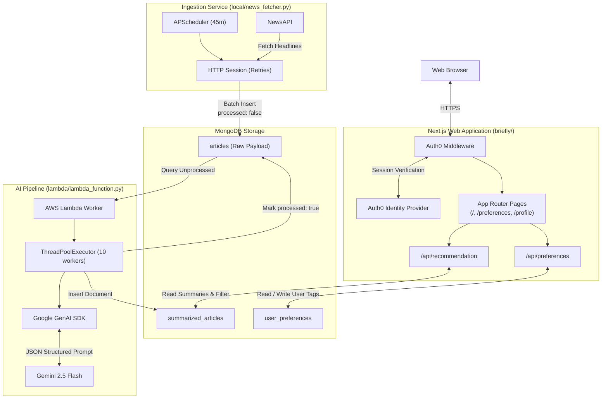

<div align="center">

# Briefly

**Personalized News Intelligence Platform**

Discover relevant news, generate AI-powered summaries, and personalize your reading experience.

<p align="center">
  
  
  
  
  
  
  
  
</p>

Briefly combines automated news ingestion, AI-powered summarization, and user preference-based recommendations into a streamlined news discovery system.

</div>

---

## Overview

Briefly addresses information overload by transforming sprawling news coverage into concise, personalized intelligence. Instead of bombarding readers with raw feeds, the platform continuously pulls articles across twenty categorical domains, distills each report into an executive summary under 150 words using Google Gemini, and serves custom feeds tailored to individual reader preferences.

The system is decoupled into three primary operational tiers:

1. **News Ingestion Engine**: An automated Python service that polls NewsAPI on an interval schedule, collecting and staging raw reporting data into MongoDB.
2. **Serverless AI Summarization Pipeline**: An AWS Lambda worker that queries unprocessed stories, sends content to Gemini 2.5 Flash via the official Google GenAI SDK, and persists structured summaries with verified categorization tags.
3. **Web Application & Recommendation Platform**: A Next.js 15 App Router web client featuring Auth0 authentication, tag preference management, and cursor-paginated content delivery.

---

## Key Features

### Personalized News Experience
- **Preference-Driven Feeds**: Users select from twenty distinct interest tags to govern content ranking and visibility.
- **Dynamic Recommendations**: Server-side filtering queries MongoDB for articles matching chosen topics, returning randomized sets to prevent stale feeds.
- **Cursor-Based Pagination**: Efficient feed navigation powered by MongoDB ObjectId pagination cursors.
- **Responsive Theme Support**: Dark and light viewing modes powered by Tailwind CSS and Next Themes.

### AI Summarization Pipeline
- **Gemini 2.5 Flash Integration**: Rapid, cost-effective article distillation using Google's generative multimodal model.
- **Strict Structured Output**: Enforced JSON formatting (`response_mime_type="application/json"`) delivering standardized summary and classification keys.
- **Fault-Tolerant Processing**: Tenacity-powered exponential backoff with retry handling to withstand transient network failures.
- **Threaded Execution**: Multi-worker thread pool executing batch summarization jobs concurrently.

### Enterprise-Grade Authentication
- **Auth0 SDK Integration**: Built on `@auth0/nextjs-auth0` v4 with custom route preservation.
- **Uniform Edge Protection**: Next.js middleware evaluating and refreshing session tokens on application requests.
- **Secure API Protection**: Route handlers protected with `auth0.withApiAuthRequired` returning 401 unauthorized challenges for unauthenticated access.
- **Server-Side Session Verification**: Page components verify user identities server-side before rendering protected layouts.

### Resilient Data Pipeline
- **Dedicated Processing States**: Clear tracking of article states (`processed: false` to `processed: true`) to prevent redundant inference runs.
- **Isolated Document Storage**: Segregation between raw inbound news payloads, generated summaries, and user account preferences.
- **Connection Reuse**: Cached MongoDB connection pools across serverless route invocations to optimize throughput.

---

## Technology Stack

| Layer | Technology | Version | Purpose |
|---|---|---|---|
| Framework | Next.js | 15.5.24 | App Router full-stack web framework |
| Frontend Library | React | 18.3.1 | Component rendering and client state |
| Styling | Tailwind CSS | 3.4.13 | Utility-first responsive styling |
| UI Components | shadcn/ui & Radix UI | Latest | Accessible UI primitives and input controls |
| Animation | Framer Motion | 11.9.0 | Micro-interactions and card animations |
| Authentication | @auth0/nextjs-auth0 | 4.29.0 | Session management and OAuth identity flows |
| Database | MongoDB | 6.10.0 (Node driver) | NoSQL storage for articles and preferences |
| AI Foundation | Google Gemini | gemini-2.5-flash | High-speed LLM article summarization |
| AI SDK | google-genai | Latest | Official Google GenAI Python library |
| Compute / Lambda | AWS Lambda | Python 3.10+ | Scheduled serverless batch inference engine |
| Ingestion Runner | Python / APScheduler | 3.10+ | Periodic NewsAPI polling service |

---

## Architecture



---

## System Data Flow

```text
1. INGESTION       -> news_fetcher.py polls NewsAPI across 20 distinct categories.
2. STAGING         -> Ingested articles are stored in MongoDB ('articles') with processed=false.
3. DISPATCH        -> AWS Lambda reads unsummarized records and distributes them to a worker pool.
4. INFERENCE       -> google-genai client dispatches prompts to Gemini 2.5 Flash.
5. PARSING         -> Gemini returns strict JSON containing 'summary' (<150 words) and 'tags'.
6. PERSISTENCE     -> Summaries are inserted into 'summarized_articles'; source marked processed=true.
7. AUTHENTICATION  -> User logs in via Auth0; middleware establishes a secure session cookie.
8. CONFIGURATION   -> User selects topic tags saved to MongoDB ('user_preferences').
9. DELIVERY        -> Next.js queries 'summarized_articles' matching tags and renders cards.
```

---

## AI Summarization

Briefly relies on Google's `google-genai` SDK and the `gemini-2.5-flash` model for high-throughput news synthesis. 

```text
Unprocessed Article URL
          |
          v
   AWS Lambda Worker
          |
          v
  Google GenAI Client (google-genai)
          |
          v
  Gemini 2.5 Flash Model
   - Prompt: Concise summary (<150 words)
   - Schema: Strict JSON output
   - Allowed Tags: Fixed 20-category taxonomy
          |
          v
  Structured JSON Output: { "summary": "...", "tags": [...] }
          |
          v
  Stored in MongoDB ('summarized_articles')
```

### Prompt Engineering and Output Validation
The inference engine issues strict instruction parameters coupled with `response_mime_type="application/json"`:

- Articles are accessed directly via URL.
- Summaries are restricted to under 150 words.
- Relevant tags are selected strictly from twenty predefined categories:
  `World News`, `Politics`, `Economy`, `Business`, `Technology`, `Health`, `Environment`, `Science`, `Education`, `Sports`, `Entertainment`, `Culture`, `Lifestyle`, `Travel`, `Crime`, `Opinion`, `Social Issues`, `Innovation`, `Human Rights`, `Weather`.
- Automated retry logic wraps inference executions using `tenacity`, guarding against temporary rate limits or latency spikes.

---

## Authentication & Authorization

Authentication is provided by Auth0 using the `@auth0/nextjs-auth0` (v4.29.0) client architecture.

### Middleware Architecture
The application intercepts traffic via `src/middleware.js`, routing requests through `auth0.middleware(request)`. All static bundles, Next.js internal images, and metadata endpoints are exempted by the middleware matcher.

### Route Handling
The client uses explicit route handlers mapped in `src/lib/auth0.js`:

| Route | Handler Method | Action |
|---|---|---|
| `/api/auth/login` | GET | Initiates OAuth redirect to Auth0 universal login |
| `/api/auth/callback` | GET | Validates authorization code and generates session cookie |
| `/api/auth/logout` | GET | Invalidates identity session and clears credentials |
| `/api/auth/me` | GET | Returns authenticated user profile JSON |

### Protected API Handlers
Database mutation and retrieval routes (`/api/preferences` and `/api/recommendation`) are wrapped in `auth0.withApiAuthRequired`. If a request lacks a valid session token, the route handler returns a `401 Unauthorized` JSON response without executing downstream database operations.

---

## Data Architecture

Briefly utilizes MongoDB as its primary persistence layer across three collections:

| Collection | Purpose | Key Document Fields |
|---|---|---|
| `articles` | Raw news items captured from NewsAPI | `url`, `title`, `author`, `publishedAt`, `urlToImage`, `processed`, `summary` |
| `summarized_articles` | Model-generated summaries available for recommendation feeds | `_id` (UUID), `title`, `author`, `url`, `summary`, `tags`, `imageUrl`, `publishDate`, `contentLength`, `status` |
| `user_preferences` | User-defined interest categories mapped to Auth0 identity | `userId` (Auth0 `sub`), `preferences` (array of category strings) |

---

## Project Structure

```text
Briefly/
├── briefly/                              # Next.js web application
│   ├── src/
│   │   ├── app/
│   │   │   ├── api/
│   │   │   │   ├── auth/                 # Auth0 routing endpoint directory
│   │   │   │   ├── preferences/
│   │   │   │   │   └── route.js          # User preference CRUD operations
│   │   │   │   └── recommendation/
│   │   │   │       └── route.js          # Recommendation query & pagination
│   │   │   ├── preferences/              # Preferences management page
│   │   │   ├── profile/                  # User account profile page
│   │   │   ├── globals.css               # Global Tailwind CSS definitions
│   │   │   ├── layout.js                 # Root layout with theme provider
│   │   │   └── page.js                   # Application root / landing view
│   │   ├── components/                   # React presentation components
│   │   │   ├── ui/                       # shadcn/ui components
│   │   │   ├── DefaultHome.jsx           # Guest landing state
│   │   │   ├── NewsApp.jsx               # Authenticated feed manager
│   │   │   ├── NewsCards.jsx             # News card grid presentation
│   │   │   ├── Recommendations.jsx       # Recommended article card
│   │   │   ├── SideBar.jsx               # Navigation drawer and profile
│   │   │   └── ThemeToggle.jsx           # Dark / light mode switcher
│   │   ├── lib/
│   │   │   ├── auth0.js                  # Auth0Client configuration
│   │   │   └── utils.js                  # Style merging helpers
│   │   └── middleware.js                 # Edge session middleware
│   ├── .env.example                      # Web application environment template
│   ├── components.json                   # UI component configuration
│   ├── next.config.mjs                   # Next.js image domain whitelist
│   ├── package.json                      # Node dependencies and scripts
│   └── tailwind.config.js                # Tailwind CSS design tokens
├── lambda/                               # AI summarization worker
│   ├── lambda_function.py                # Batch Gemini processor
│   └── requirements.txt                  # Python dependencies for Lambda
├── local/                                # News ingestion service
│   └── news_fetcher.py                   # NewsAPI polling script
├── .env.example                          # Root backend environment template
├── .gitignore                            # Git exclusion rules
└── README.md                             # Project documentation
```

---

## Environment Configuration

Configuration is managed strictly through environment variables. Example configurations are provided in `.env.example` and `briefly/.env.example`.

### Web Application (`briefly/.env.local`)
```env
# MongoDB Connection
MONGO_URI=mongodb+srv://<username>:<password>@cluster.mongodb.net
MONGO_DB_NAME=news_db
MONGO_PREFERENCES_COLLECTION_NAME=user_preferences
MONGO_RECOMMENDATION_COLLECTION_NAME=summarized_articles

# Auth0 Authentication
AUTH0_DOMAIN=your-tenant.auth0.com
AUTH0_CLIENT_ID=your_client_id
AUTH0_CLIENT_SECRET=your_client_secret
AUTH0_SECRET=use_a_long_random_32_byte_string
APP_BASE_URL=http://localhost:3000
AUTH0_ISSUER_BASE_URL=https://your-tenant.auth0.com
AUTH0_BASE_URL=http://localhost:3000
```

### Ingestion & Lambda Worker (`.env`)
```env
# MongoDB Connection
MONGO_URI=mongodb+srv://<username>:<password>@cluster.mongodb.net
MONGO_DB_NAME=news_db
MONGO_ARTICLES_COLLECTION_NAME=articles
MONGO_SUMMARIZED_COLLECTION_NAME=summarized_articles

# Google Gemini AI
GEMINI_API_KEY=your_gemini_api_key
GEMINI_MODEL=gemini-2.5-flash

# News Ingestion
NEWS_API_KEY=your_news_api_key
```

> **Security Notice**: Never commit `.env` or `.env.local` files to version control. They are strictly ignored by `.gitignore`.

---

## Getting Started

### Prerequisites
- **Node.js**: v20.x or higher
- **Python**: v3.10 or higher
- **MongoDB Instance**: Atlas cluster or local MongoDB instance
- **Auth0 Account**: Configured Regular Web Application with `http://localhost:3000/api/auth/callback` in Allowed Callback URLs and `http://localhost:3000` in Allowed Logout URLs
- **Google AI Studio API Key**: Configured with Gemini 2.5 Flash access
- **NewsAPI Account**: API key for news headlines ingestion

### Installation

1. **Clone the repository**:
   ```bash
   git clone https://github.com/mohdarsh786/Briefly.git
   cd Briefly
   ```

2. **Install Web Application Dependencies**:
   ```bash
   cd briefly
   npm install
   ```

3. **Install Python Worker Dependencies**:
   ```bash
   # Lambda summarizer requirements
   cd ../lambda
   pip install -r requirements.txt

   # Local news fetcher requirements
   cd ../local
   pip install python-dotenv requests pymongo apscheduler urllib3
   ```

### Running Locally

1. **Start the Next.js Web Application**:
   ```bash
   cd briefly
   npm run dev
   ```
   Open [http://localhost:3000](http://localhost:3000) in your browser.

2. **Start the News Ingestion Service**:
   ```bash
   cd local
   python news_fetcher.py
   ```

3. **Run the AI Summarization Worker**:
   ```bash
   cd lambda
   python lambda_function.py
   ```

### Building for Production
```bash
cd briefly
npm run build
npm start
```

---

## Validation

The project codebase has been validated through the following verified procedures:

| Verification Target | Command | Result |
|---|---|---|
| Next.js Production Build | `npm run build` | Passed (Route compilation & static generation successful) |
| JavaScript / React Linting | `npm run lint` | Passed (Zero syntax errors) |
| Python Lambda Syntax | `python -m py_compile lambda/lambda_function.py` | Passed (Bytecode compilation clean) |
| Python Ingestion Syntax | `python -m py_compile local/news_fetcher.py` | Passed (Bytecode compilation clean) |
| Git Whitespace / Formatting | `git diff --check` | Passed (Zero format anomalies) |

*Automated test suites (unit/integration) are not yet implemented. System correctness is validated through static analysis, compilation checks, and functional API verification.*

---

## Security

- **Zero Hardcoded Credentials**: API tokens, database URIs, and cryptographic signing keys reside exclusively in untracked environment files.
- **Server-Side Credential Isolation**: The Gemini API key, MongoDB connection strings, and Auth0 client secrets are processed only in server runtimes and never sent to client bundles.
- **Protected Endpoints**: Recommendation and preference APIs reject unauthorized traffic with immediate 401 status responses via `withApiAuthRequired`.
- **Restricted Remote Media**: Next.js image loading is constrained via `remotePatterns` to trusted avatar CDNs (`lh3.googleusercontent.com`, `s.gravatar.com`).
- **Sanitized AI Parsing**: Summaries returned from the generative model are cleaned of formatting fences before JSON deserialization to prevent injection or malformed data errors.

---

## Current Status

| Area | Status | Notes |
|---|---|---|
| Framework Upgrade | Complete | Next.js 15.5.24 App Router runtime |
| Auth0 Migration | Complete | Migrated to `@auth0/nextjs-auth0` v4 with custom route handlers |
| Gemini AI Integration | Complete | Migrated to `google-genai` SDK targeting `gemini-2.5-flash` |
| UI & Theme Architecture | Complete | Tailwind CSS styling with safe token generation |
| Production Build | Verified | Successfully compiles with dynamic route generation |
| Codebase Hygiene | Verified | Debug logs, agent narration, and dead comments removed |

---

## Future Improvements

- **Automated Test Coverage**: Introduce Playwright end-to-end tests and Jest unit tests for API route handlers.
- **Continuous Integration**: Implement GitHub Actions workflows for automated linting, type checks, and build validation on pull requests.
- **Recommendation Optimization**: Enhance the recommendation algorithm beyond randomized tag matching by incorporating read history and collaborative filtering.
- **Cache Layering**: Integrate Redis to cache user feed recommendations and reduce database load during peak traffic.
- **Containerization**: Provide Dockerfiles and a `docker-compose.yml` for unified local development across the web app, fetcher, and worker.
- **Rate Limiting**: Add rate-limiting middleware to protect public and authenticated endpoints from abuse.

---

## License

License information has not yet been specified for this project.
